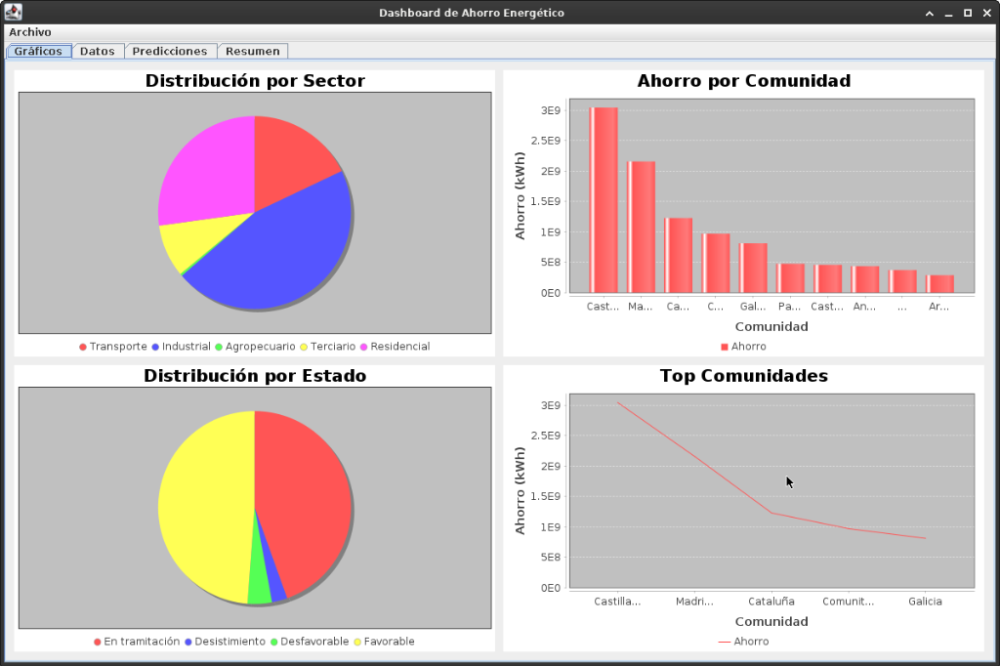

# ⚡ Dashboard de Análisis de Ahorro Energético (SGC)



Aplicación de escritorio desarrollada en **Java Swing** para el análisis y visualización de datos de **ahorro energético** provenientes del sistema **SGC**.
Incluye visualizaciones interactivas, análisis de datos y modelos de **Machine Learning**, todo ejecutándose de forma **dockerizada**.

---

## ✨ Características Principales

* 📁 **15,899 registros** cargados desde archivos CSV
* 📊 **Dashboard interactivo** con gráficos usando **JFreeChart**
* 🤖 **Análisis predictivo** mediante **Machine Learning (Weka)**
* 🗂️ Interfaz organizada en **4 pestañas funcionales**
* 🐳 **Dockerizado** (Java 11) – sin necesidad de `docker-compose`

---

## 🧭 Estructura del Dashboard

La aplicación cuenta con las siguientes pestañas:

1. **Gráficos**
   Visualización de datos energéticos mediante gráficos dinámicos.
2. **Datos**
   Tabla completa con los **15,899 registros** cargados.
3. **Predicciones**
   Modelos de Machine Learning aplicados con **Weka**.
4. **Resumen**
   Métricas clave y resultados consolidados.

---

## 🚀 Ejecución de la Aplicación

### 📋 Requisitos Previos

* Docker **20.10 o superior** (detectado: **29.2.0 ✅**)
* Sistema Linux con soporte **X11**
* ❌ No se requiere `docker-compose`

---

### ▶️ Ejecución Rápida

```bash
cd /home/robot/Documentos/Java/P1/Sistema-de-Gestion-CAE
./run.sh
```

El script utiliza comandos nativos de Docker:

* `docker build` para construir la imagen
* `docker run` para ejecutar el contenedor

---

## 🐳 Ejecución Manual con Docker

Si prefieres ejecutar los comandos manualmente:

```bash
# Construir la imagen
docker build -t sgc-dashboard:latest .

# Permitir acceso al servidor X
xhost +local:docker

# Ejecutar la aplicación
docker run --rm \
    --name sgc-dashboard \
    -e DISPLAY=$DISPLAY \
    -v /tmp/.X11-unix:/tmp/.X11-unix:rw \
    -v $(pwd)/data:/app/data:ro \
    --network host \
    sgc-dashboard:latest
```

---

## 🐛 Solución de Problemas

### ❌ La interfaz gráfica no aparece

```bash
xhost +local:docker
./run.sh
```

Asegúrate de estar ejecutando el contenedor desde una sesión gráfica con X11.

---

### 🔒 Problemas de permisos con Docker

```bash
sudo usermod -aG docker $USER
# Cierra sesión y vuelve a entrar
```

---

### 📜 Ver logs del contenedor

```bash
docker logs sgc-dashboard
```

---

### 🧹 Limpiar la imagen Docker

```bash
docker rmi sgc-dashboard:latest
```

---

## 🔧 Tecnologías Utilizadas

* ☕ **Java 11**
* 📦 **Maven 3.8.6**
* 🤖 **Weka 3.8.6**
* 📊 **JFreeChart 1.5.3**
* 🐳 **Docker** (sin docker-compose)

---

## ✅ Estado del Proyecto

**Listo para ejecutar con un solo comando:**

```bash
./run.sh
```

🚀 *Dashboard funcional, portable y preparado para análisis energético avanzado.*
